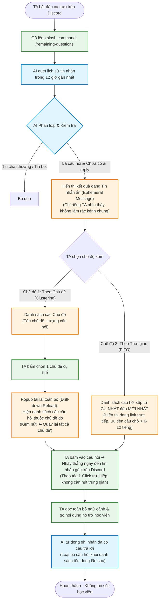

# Sơ đồ Luồng Trải Nghiệm (User Flow) — Tính năng `/remaining-questions`

> **Dự án:** Trợ lý Hỗ trợ Kỹ thuật & Quản lý Hàng đợi Câu hỏi Tồn đọng cho TA (Track B2)  
> **Nhóm:** Phronesis · Phòng E403 · Lớp 3A · Batch 04  
> **Checkpoint:** CP2 (Cho thấy luồng hoạt động)

---

## 1. Lát cắt Một câu (Core Slice)
> *"Một TA gõ lệnh `/remaining-questions` trên Discord ➔ AI quét tin nhắn 12 giờ qua, lọc câu hỏi kỹ thuật chưa được phản hồi và phân loại theo chủ đề / thời gian dưới dạng tin nhắn ẩn riêng tư (Ephemeral Message) ➔ TA bấm link điều hướng nhảy thẳng đến tin nhắn gốc của học viên trên Discord để xem toàn bộ ngữ cảnh và hỗ trợ ➔ Hệ thống tự động đánh dấu đã giải quyết sau khi TA phản hồi."*

---

## 2. Sơ đồ Luồng (Mermaid Flowchart)

---

## 3. Diễn giải Chi tiết Từng Bước

### Bước 1: Kích hoạt (Trigger)
* **Người thực hiện:** Trợ giảng (TA) trực nhật trên Discord.
* **Thao tác:** Gõ lệnh `/remaining-questions` trong bất kỳ kênh text channel nào.

### Bước 2: AI Quét & Phân loại (Processing)
* **Phạm vi quét:** Quét toàn bộ tin nhắn trong **12 giờ gần nhất** (giải quyết đúng kỷ lục tồn đọng 12h thu thập từ khảo sát TA).
* **Quyết định của AI:** 
  1. Nhận diện tin nhắn nào là **câu hỏi thực sự** (loại bỏ lời chào, thảo luận phiếm, thông báo bot).
  2. Kiểm tra xem tin nhắn đó **đã có người trả lời (thread reply hoặc mention) chưa**.

### Bước 3: Trải nghiệm Giao diện Riêng tư (Private / Ephemeral UI)
* *(Đã bổ sung góp ý 1)*: Tin nhắn phản hồi của Bot là dạng **Ephemeral Message** (chỉ có TA gõ lệnh mới nhìn thấy), giúp giữ kênh chung sạch sẽ, không làm hoang mang học viên.
* **Cơ chế Giới hạn (Limit 15 câu/popup - Có thể tùy chỉnh):** Áp dụng cho cả 2 chế độ xem, mặc định hiển thị tối đa **15 câu hỏi** (có thể chọn 5, 10, 15, 20) nhằm tránh quá tải thông tin (Information Overload) cho TA và phù hợp với giới hạn hiển thị của Discord.
* **Nút Làm mới (Reload Button):** Tích hợp nút `🔄 Làm mới` ngay trên thanh công cụ của popup để TA có thể chủ động kích hoạt quét lại tin nhắn mới nhất trong 12h mà không cần phải gõ lại lệnh `/remaining-questions`.
* **Cung cấp 2 chế độ xem linh hoạt:**
  * **Chế độ 1 (Theo Chủ đề - Drill-down Reload):** Ban đầu chỉ hiển thị danh sách `Tên chủ đề: Lượng câu hỏi`. Khi TA bấm vào một chủ đề cụ thể, **toàn bộ popup sẽ tự động tải lại (reload)** chuyển sang danh sách các câu hỏi của riêng chủ đề đó (kèm nút `⬅️ Quay lại tất cả chủ đề`) thay vì mở dropdown làm dài và rối màn hình.
  * **Chế độ 2 (Theo Thời gian - FIFO Queue):** Sắp xếp thứ tự câu hỏi từ cũ nhất đến mới nhất, giúp TA ưu tiên giải cứu các ca học viên bị kẹt lâu nhất (chờ > 6–12 tiếng).

### Bước 4: Điều hướng 1-Click & Đóng vòng lặp (Direct Navigation)
* **Tối ưu hóa thao tác (1-Click Interaction):** Mỗi mục câu hỏi trong danh sách chính là một **Hyperlink / Message Link trực tiếp**. TA bấm chọn câu hỏi là Discord tự động cuộn màn hình nhảy ngay đến tin nhắn gốc của học viên.
* **Loại bỏ trung gian:** Không cần màn hình popup tóm tắt và không cần nút phụ "Jump to message". Thao tác diễn ra tức thì, giúp TA giải quyết nhanh nhất có thể.
* *(Đã bổ sung góp ý 2)*: Sau khi TA phản hồi học viên, trong lần quét kế tiếp, hệ thống tự động xác nhận câu hỏi đã có tương tác và **tự động gạch tên khỏi danh sách tồn đọng**.
