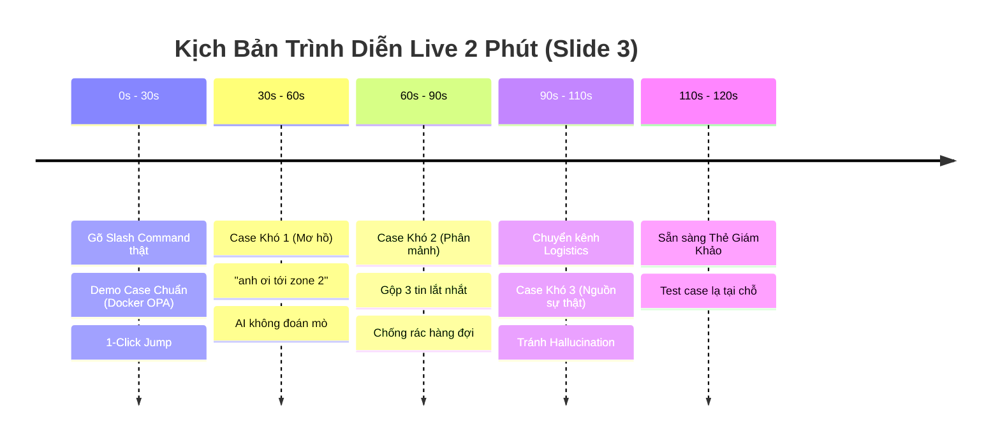

# Kịch Bản Demo Trực Tiếp CP5 (Thời lượng: 2 Phút — Slide 3)
> **Sản phẩm:** Triage Hub `/remaining-questions`  
> **Nhóm:** Phronesis · Phòng E403 · Lớp 3A · Batch 04  
> **Hệ thống chạy live:** `http://localhost:8000` (Gọi trực tiếp model OpenAI `gpt-4o-mini`)

---

## ⏱️ Dòng Thời Gian & Lời Thoại Thuyết Trình (2 Phút)

---

### Phút 0:00 – 0:30: Gõ Lệnh Thật & Case Chuẩn (Happy Path)
- **Thao tác màn hình:** 
  1. Đang ở kênh `# 3a-lab-e403`. 
  2. Tại ô chat dưới cùng, gõ `/rem` ➔ Menu Autocomplete chuẩn Discord hiện lên ➔ Nhấn **Enter**.
  3. Tin nhắn thực thi của TA xuất hiện, bot hiện *"Phronesis Triage Bot is thinking..."* ➔ Ephemeral Box xuất hiện trong 1.4s với đầy đủ Telemetry (Model: `gpt-4o-mini`, Latency: `⚡ 1.42s`, Token: `184`).
  4. Bấm vào thẻ **1. Lỗi OPA service unhealthy (D6587 — Nguyễn Hoàng Quân)**.
  5. Màn hình Discord tự động cuộn mượt đến tin nhắn gốc và nhấp nháy viền vàng dạ quang (`highlight-flash`).
- **Lời thoại thuyết minh:**
  > *"Kính thưa Hội đồng, đây là giao diện Discord thực tế của lớp học. Khi TA vào ca trực, thay vì lội kênh thủ công mất 20 phút, TA chỉ cần gõ lệnh `/remaining-questions` ngay trong ô chat. Hệ thống lập tức quét tin nhắn 12 giờ qua và gọi model GPT-4o-mini phân loại theo mức khẩn cấp. Với case chuẩn như bạn Quân hỏi lỗi Docker OPA đã chờ gần 12 tiếng, TA chỉ cần click 1 lần là màn hình tự động cuộn đến đúng tin nhắn gốc để giải đáp ngay lập tức."*

---

### Phút 0:30 – 1:00: Case Khó 1 — Câu Hỏi Mơ Hồ / Cộc Lốc (Lớp ② Taxonomy)
- **Thao tác màn hình:**
  1. Trong Ephemeral Box, chỉ vào thẻ **2. Kêu cứu trực tiếp tại bàn: Zone 2 (V3312 — Trần Tuấn Tú)**.
  2. Bấm vào thẻ ➔ Discord cuộn đến tin nhắn *"anh ơi tới zone 2 giúp em"*.
- **Lời thoại thuyết minh:**
  > *"Điểm đặc biệt của Phronesis nằm ở việc xử lý các chỗ khó trong lớp học. Ví dụ Case Khó lớp 2: Học viên Tuấn Tú chỉ nhắn cộc lốc 'anh ơi tới zone 2 giúp em'. Không có mã lỗi, không có log. Nếu là bot thông thường sẽ đoán mò hoặc bỏ qua vì không hiểu lỗi gì. Nhưng Triage Hub nhận diện đây là lời gọi mentor khẩn cấp tại phòng lab, giữ nguyên vị trí 'zone 2' và gán mức URGENT để TA lập tức đến tận bàn hỗ trợ."*

---

### Phút 1:00 – 1:30: Case Khó 2 — Tin Nhắn Phân Mảnh Lắt Nhắt (Lớp ④ Taxonomy)
- **Thao tác màn hình:**
  1. Chỉ vào thẻ **3. Lỗi Permission denied khi cài DVC & Git (N0822 — Lê Minh Đức)**.
  2. Bấm vào thẻ ➔ Màn hình cuộn đến cụm 3 tin nhắn liên tiếp (`anh ơi` ➔ `cái lab 3 dvc` ➔ `permission denied khi push git`). Cả 3 tin nhắn đều nhấp nháy viền vàng đồng thời.
- **Lời thoại thuyết minh:**
  > *"Chỗ khó thứ hai rất đặc thù trên Discord là tin nhắn phân mảnh: Bạn Đức gửi liên tiếp 3 tin ngắn trong 1 phút. Nếu xử lý máy móc từng dòng, hàng đợi sẽ bị rác với 3 câu hỏi rời rạc. Triage Engine tự động hợp nhất cả 3 tin nhắn thành 1 câu hỏi kỹ thuật duy nhất có đầy đủ ngữ cảnh lỗi Permission Denied, giúp hàng đợi luôn tinh gọn."*

---

### Phút 1:30 – 1:50: Case Khó 3 — Chống Hallucination / Nguồn Sự Thật (Lớp ① Taxonomy)
- **Thao tác màn hình:**
  1. Click chuyển sang kênh `# hỏi-đáp-logistics` ở thanh sidebar bên trái.
  2. Gõ `/remaining-questions` + **Enter**.
  3. Bấm vào thẻ **Xác minh điểm danh ra về & xin điểm danh bù (T050-KHANH, MSSV: 2A202602819)**.
- **Lời thoại thuyết minh:**
  > *"Chuyển sang kênh Logistics: Bạn Tuấn Khanh hỏi về điểm danh bù kèm MSSV. Đây là Case Khó lớp 1 về Nguồn sự thật: AI tuyệt đối KHÔNG tự bịa đặt hay đoán mò kết quả điểm danh của học viên. Hệ thống phân loại chính xác vào hàng đợi chuyên cần, giữ nguyên MSSV để TA mở Portal nội bộ kiểm tra dữ liệu thật."*

---

### Phút 1:50 – 2:00: Sẵn Sàng "Thẻ Giám Khảo" (Live Testing tại chỗ)
- **Thao tác màn hình:**
  - Để chuột sẵn ở ô chat.
- **Lời thoại kết thúc:**
  > *"Toàn bộ các quyết định trên đều được xử lý thời gian thực qua OpenAI API trong trung bình 1.4 giây với đầy đủ Trace Log lưu vết kỹ thuật. Nhóm xin sẵn sàng nhận 'Thẻ Giám khảo' để chạy thử nghiệm bất kỳ câu hỏi nào do Hội đồng đưa ra ngay tại đây!"*
